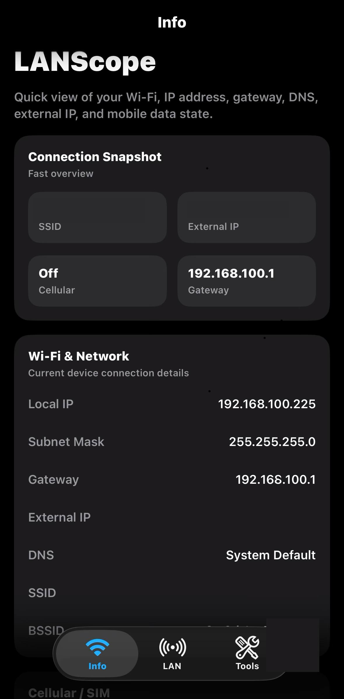
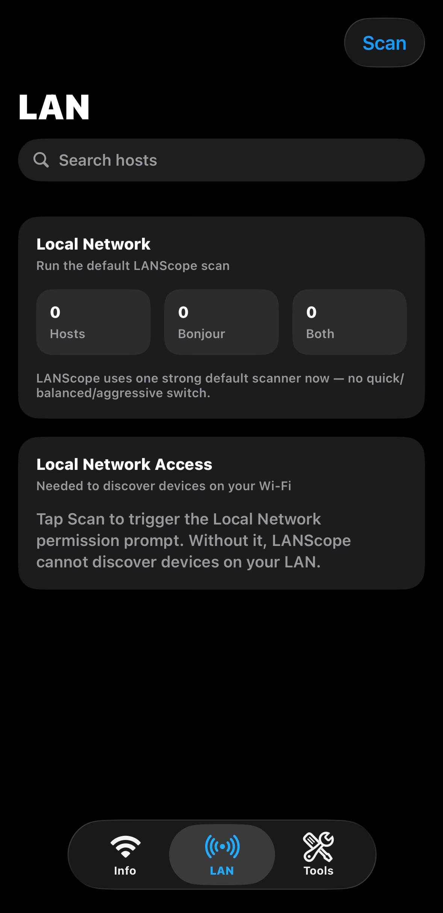
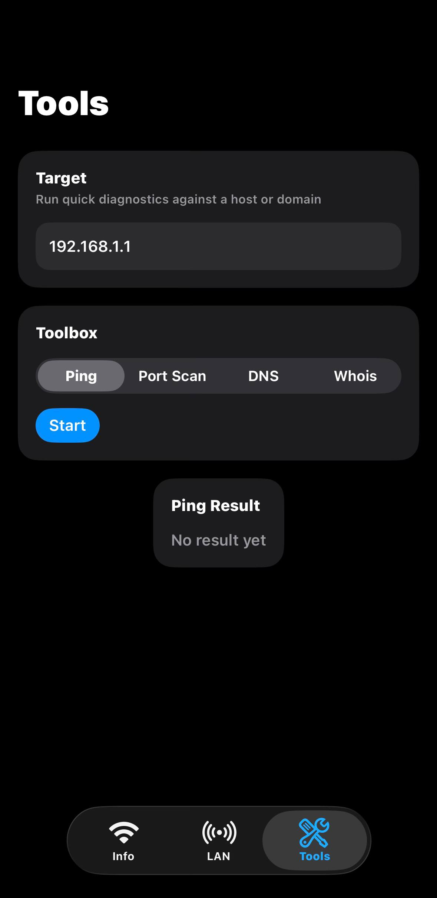

# LANScope

LANScope is a native SwiftUI iOS network utility app for inspecting your current network connection, discovering devices on your LAN, and running practical network tools from an iPhone.

It is designed as a modern iOS alternative to classic network utility apps, with a focus on:

- Wi‑Fi and connection info
- LAN discovery
- Bonjour / mDNS discovery
- host details and port visibility
- DNS / WHOIS / reachability tools
- a clean, mobile-first UI

---

## Highlights

- native SwiftUI iOS app
- stronger default LAN scanner
- Bonjour / mDNS integration
- host caching and repeat-scan merge behavior
- first-launch permission onboarding
- host detail pages and export/share flow
- unsigned IPA release artifact for testing/reference

---

## Screenshots

### Info

### LAN

### Tools

---

## Features

### Info tab
- local IP address
- subnet mask
- gateway
- external IP
- DNS summary
- SSID / BSSID when iOS allows it
- limited cellular / mobile data info

### LAN tab
- stronger default LAN scan
- Bonjour / mDNS discovery
- host source badges:
  - `PORT`
  - `BONJOUR`
  - `BOTH`
  - `CACHED`
- repeated-scan merge behavior
- recent host caching
- host detail screen
- export/share scan results

### Tools tab
- ping-style reachability test
- DNS lookup
- WHOIS / RDAP lookup
- port scan with custom ports/ranges

### Onboarding / permissions
- first-launch permission onboarding
- Location prompt flow for SSID/BSSID access
- Local Network prompt flow for LAN discovery

---

## Permissions

LANScope needs only the permissions required for its networking features:

- **Local Network** — required for LAN scanning and Bonjour discovery
- **Location When In Use** — required by iOS for SSID / BSSID access

---

## Build

### Requirements
- Xcode
- iOS 26.0+

### Local build
Open:

- `LANScope.xcodeproj`

Then build/run from Xcode.

### Unsigned IPA artifact
Local output path:

- `build-artifacts/LANScope-unsigned.ipa`

A release artifact is also attached on GitHub Releases.

---

## Project structure

- `LANScope/App/` — app entry and root tabs
- `LANScope/Models/` — data models
- `LANScope/Services/` — network, discovery, cache, permission services
- `LANScope/ViewModels/` — UI state and orchestration
- `LANScope/Views/` — screens and reusable SwiftUI components
- `docs/` — release/process docs and screenshots

---

## Current status

LANScope is currently an actively iterated MVP.

Already implemented:
- SwiftUI app structure
- Info / LAN / Tools tabs
- stronger default LAN scanner
- Bonjour discovery integration
- host caching / merge logic
- onboarding for required permissions
- unsigned IPA packaging flow

Still worth improving:
- richer device fingerprinting and service-based identification
- stronger router, TV, printer, NAS, and smart-device classification
- manual subnet and custom IP-range scanning
- favorites, scan history, and saved hosts
- signed export and distribution workflow

---

## Releases

See GitHub Releases for tagged builds and unsigned IPA artifacts.

Release/process notes:

- `docs/RELEASE.md`

---

## License

MIT — see `LICENSE`.
